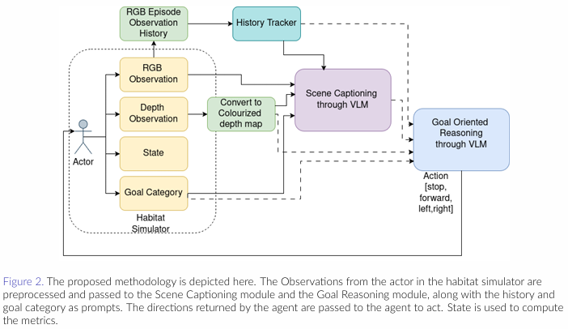
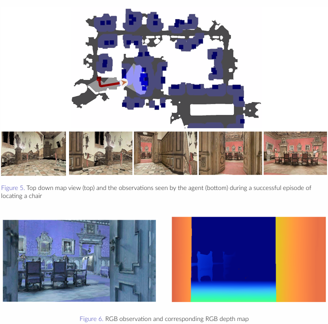

# ICC-OpenVLM-Nav
Through this work we try to see the suitability of open VLM's like CLIP, BLIP and Qwen towards embodied navigation, without any pre training.

## Steps to set up repository

1. Clone the [PixNav](https://github.com/wzcai99/Pixel-Navigator) Repository by following the steps on their page
2. Within Pixel-Navigator directory clone [habitat-lab](https://github.com/facebookresearch/habitat-lab) and download MP3D dataset
3. Install dependencies like pytorch, transformers, numpy
4. Clone the files from our repository into Pixel-Navigator directory

## Methodology


## Sample Trajectory



## Citation

If you use this work, please cite:

```bibtex
@inproceedings{r2025openvlmnav,
  title={Open{VLM}-Nav: Training-Free Zero-Shot Object-Goal Navigation via Vision-Language Guidance},
  author={Athira Krishnan R and Swapnil Bag and Sumohana S. Channappayya},
  booktitle={Submitted to Indian Control Conference 2025 Workshop on Advances in AI-Driven Control and Estimation for Robotics and Autonomous Systems},
  year={2025},
  url={https://openreview.net/forum?id=NzYQd6TLW2},
  note={Accepted (Oral)}
}
